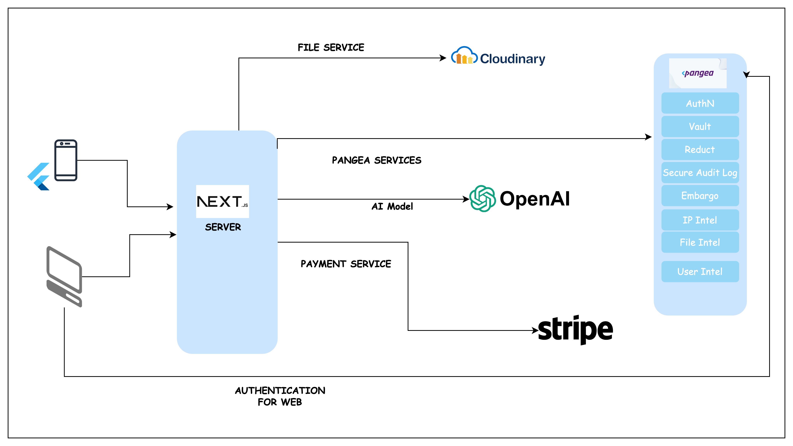

# FundStart

FundStart is a comprehensive investment platform that connects entrepreneurs with investors, providing a seamless and secure environment for early-stage startup funding. Whether you're an entrepreneur seeking funding for your innovative idea or an investor looking for the next big opportunity, FundStart has you covered.

## Features

- **Investment Tracking**: Easily track your investments and monitor their performance in real-time.
- **Unlimited Investment Opportunities**: Access a wide range of investment opportunities from innovative startups across various industries.
- **Secure Authentication with Pangea.cloud**: Ensure the security of your account with robust authentication powered by Pangea.cloud.
- **Payment Integration with Stripe**: Seamlessly manage financial transactions with secure payment integration using Stripe.
- **AI-Powered Investment Assistant**: Receive personalized investment recommendations tailored to your preferences and investment goals.
- **Secure Card Wallet Integration**: Safely store and manage your financial assets with the ability to securely add card wallets.
- **Cross-Platform Availability**: Access FundStart on both Android and iOS devices for a seamless investment experience.

## Technologies Used

- Next.js for web development
- Flutter for cross-platform mobile development
- Stripe for payment integration
- OpenAI for AI-powered investment assistance
- Cloudinary for media management
- PostgreSQL for data storage
- Pangea.cloud for secure authentication, data reduction, embargo enforcement, and more.

## Requirement

1. Nodejs version >= 16
2. Environments variable in .env file, sample configuration can be seen in .env.template and below.

## Environments Variables

```
NEXT_PUBLIC_PANGEA_DOMAIN=
NEXT_AUTHN_TOKEN=
NEXT_PUBLIC_AUTHN_CLIENT_TOKEN=
NEXT_PUBLIC_AUTHN_HOSTED_LOGIN_URL=
NEXT_PUBLIC_REDIRECT_URL=
NEXT_PANGEA_REDACT_TOKEN=
NEXT_PANGEA_VAULT_TOKEN=
NEXT_PANGEA_FileIntel=
NEXT_PANGEA_UserIntel=
NEXT_PANGEA_SECURE_AUDIT=
NEXT_PANGEA_IP_Service=
NEXT_PANGEA_EMBARGO_Service=


DATABASE_URL=

STRIPE_PAYSTACK_KEY=
STRIPE_WEBHOOK=

OPENAI_API_KEY=
```

## Getting Started

1. Clone the repository: `git clone https://github.com/OtchereDev/fundstarty.git`
2. Install dependencies: `npm install`
3. Start the development server: `npm run dev`

## Pangea Service Implementation Location

All (98%) of the implementation of pangea services were on the API which can be found in the **[src/pages/api](src/pages/api)** directory. Except for the implementation of the single sign on using @pangeacyber/react-auth which can be found in the **[src/pages/\_app.tsx](src/pages/_app.tsx)** file

## Architecture



## License

This project is licensed under the [MIT License](LICENSE).
